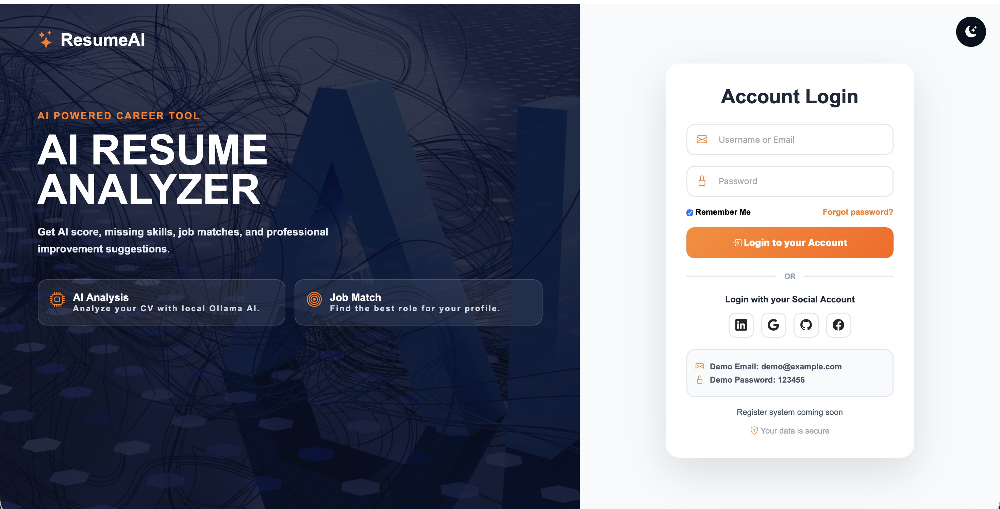
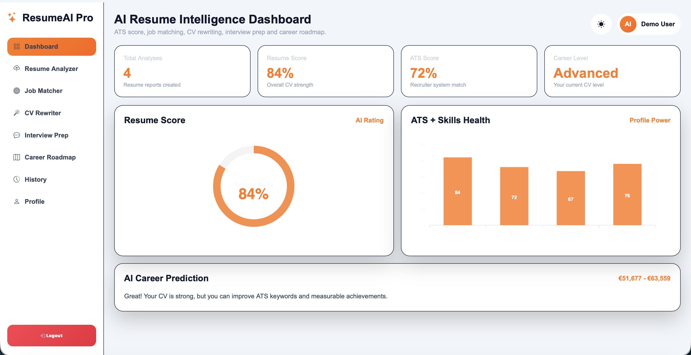
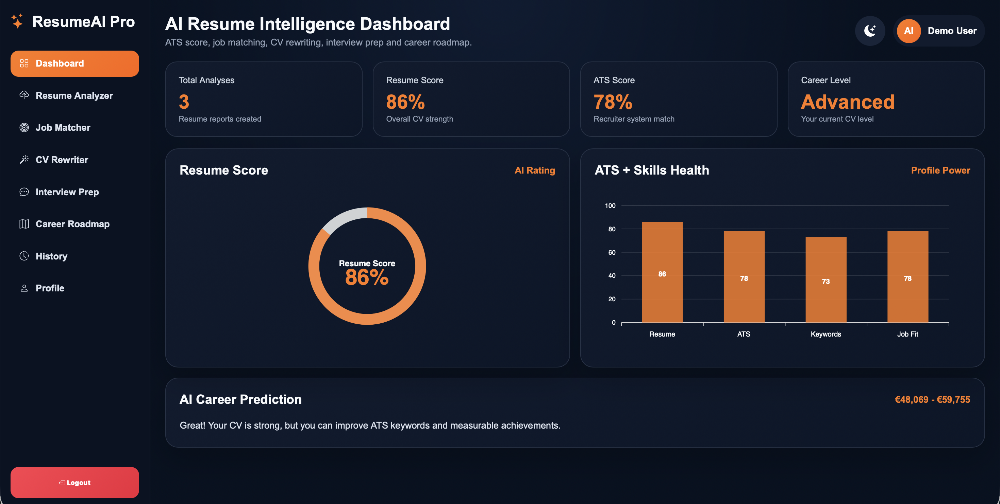
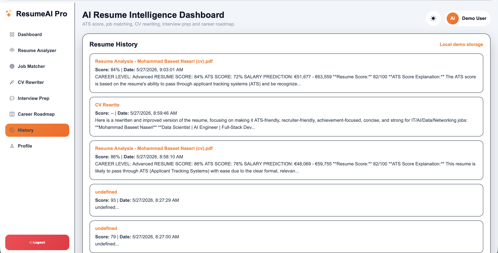

# AI Resume Analyzer Pro 
Modern AI-powered Resume Analysis Platform built with:
- FastAPI
- Python
- HTML
- CSS
- JavaScript
- Bootstrap 5
- Ollama Local AI
- ApexCharts
- SQLite Database
- Modern SaaS Dashboard UI
---
# Features 
- AI Resume Analysis
- Resume Score Generator
- Skills Detection
- Missing Skills Analysis
- Job Match Prediction
- Suggested Job Roles
- Resume Improvement Suggestions
- PDF Resume Upload
- Resume History
- AI Career Recommendations
- Dashboard Analytics
- PDF Export Report
- Light / Dark Mode
- Modern Sidebar Navigation
- Animated Charts
- Responsive Design
- Local AI with Ollama
- FastAPI Backend
- SQLite Database
- Professional Login UI
- Professional Dashboard UI
---
# Screenshots 
## Login Page

---
## Dashboard Result

---
## AI Analysis

---
## Resume History

---
# Installation Guide (Mac)
## 1. Clone Repository
```bash
git clone https://github.com/YOUR_USERNAME/AI-Resume-Analyzer.git

⸻

2. Open Project

cd AI-Resume-Analyzer

⸻

3. Create Virtual Environment

cd backend
python3 -m venv venv

⸻

4. Activate Environment

source venv/bin/activate

⸻

5. Install Requirements

pip install -r requirements.txt

OR manually:

pip install fastapi uvicorn sqlalchemy python-multipart requests ollama

⸻

6. Install Ollama

Download:

https://ollama.com/download/mac

Then install model:

ollama pull llama3.1

⸻

7. Run Backend

uvicorn main:app --reload

Backend runs on:

http://127.0.0.1:8000

⸻

8. Run Frontend

Open second terminal:

cd frontend
python3 -m http.server 5500

Open browser:

http://localhost:5500

⸻

Installation Guide (Windows)

1. Install Python

Download:

https://python.org

IMPORTANT:

Enable:

[x] Add Python to PATH

⸻

2. Install VS Code

Download:

https://code.visualstudio.com/

Install extensions:

* Python
* Live Server

⸻

3. Clone Repository

git clone https://github.com/YOUR_USERNAME/AI-Resume-Analyzer.git

⸻

4. Open Project

cd AI-Resume-Analyzer

⸻

5. Create Virtual Environment

python -m venv venv

⸻

6. Activate Environment

venv\Scripts\activate

⸻

7. Install Requirements

pip install -r requirements.txt

OR manually:

pip install fastapi uvicorn sqlalchemy python-multipart requests ollama

⸻

8. Install Ollama

Download:

https://ollama.com/download/windows

Install model:

ollama pull llama3.1

⸻

9. Run Backend

uvicorn main:app --reload

⸻

10. Run Frontend

Open frontend/index.html with Live Server

OR:

cd frontend
python -m http.server 5500

⸻

Folder Structure 

AI-Resume-Analyzer
│
├── backend
│   ├── auth.py
│   ├── database.py
│   ├── models.py
│   ├── main.py
│   ├── resume_ai.db
│   ├── requirements.txt
│   └── venv
│
├── frontend
│   ├── dashboard.html
│   ├── dashboard.css
│   ├── dashboard.js
│   ├── index.html
│   ├── login.css
│   ├── login.js
│   ├── register.html
│   ├── register.css
│   ├── register.js
│   ├── style.css
│   └── script.js
│
├── screenshots
│   ├── login.png
│   ├── result.png
│   ├── result-1.png
│   └── history.png
│
├── README.md
└── .gitignore

⸻

Future Features 

* ATS Resume Checker
* AI Cover Letter Generator
* AI Interview Questions
* AI Career Roadmap
* LinkedIn Optimization
* Resume Version Comparison
* AI Job Recommendation Engine
* Cloud Deployment
* JWT Authentication
* Multi-user Accounts
* Vector Database
* GPT Integration
* Voice AI Assistant
* Real-time Resume Coaching

⸻

Skills Demonstrated 

* FastAPI API Development
* REST APIs
* Local LLM Integration
* Modern Dashboard UI/UX
* Responsive Web Design
* AI Prompt Engineering
* File Upload Systems
* SQLite Database
* Authentication System
* Frontend + Backend Integration

⸻

Author 

Mohamad Baseet Naseri

* Data Scientist
* AI Engineer
* Full-Stack Developer
* Networking & Automation Enthusiast

Portfolio:
https://naseriai.com

LinkedIn:
https://linkedin.com/in/baseetnaseri6

GitHub:
https://github.com/baseetnaseri6

⸻

License 📜

MIT License

: